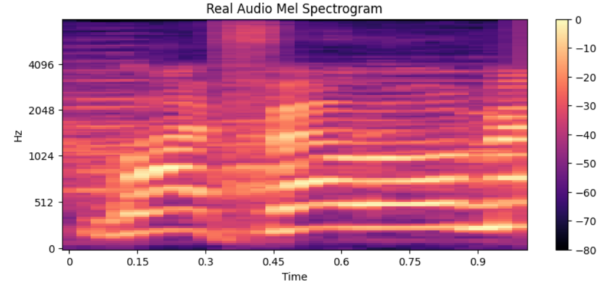
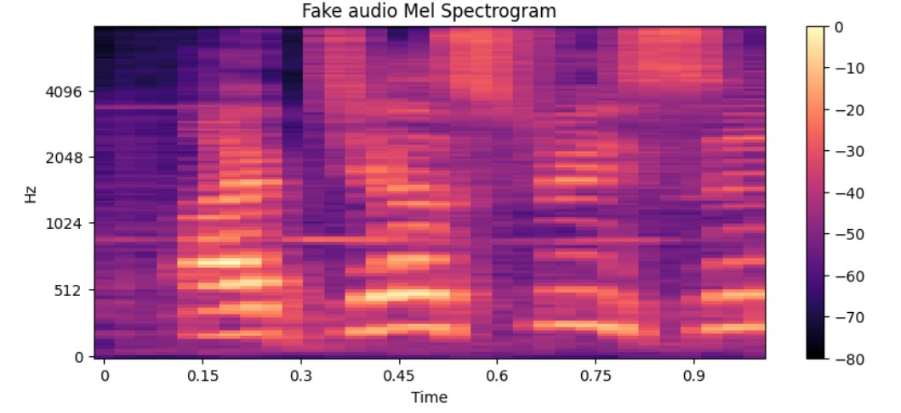
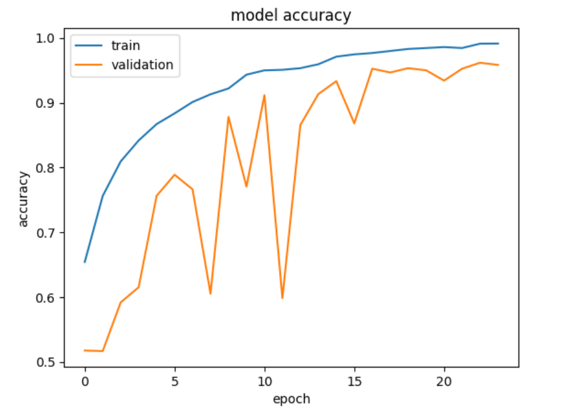
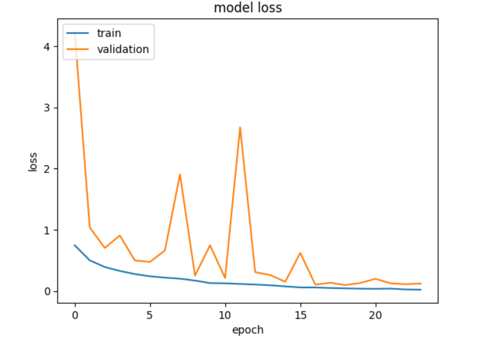
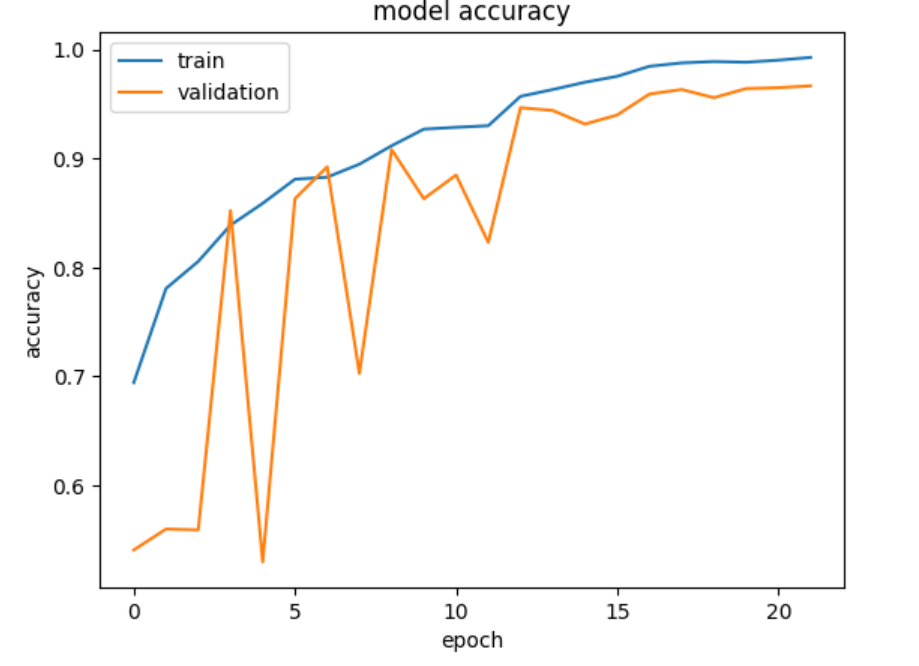
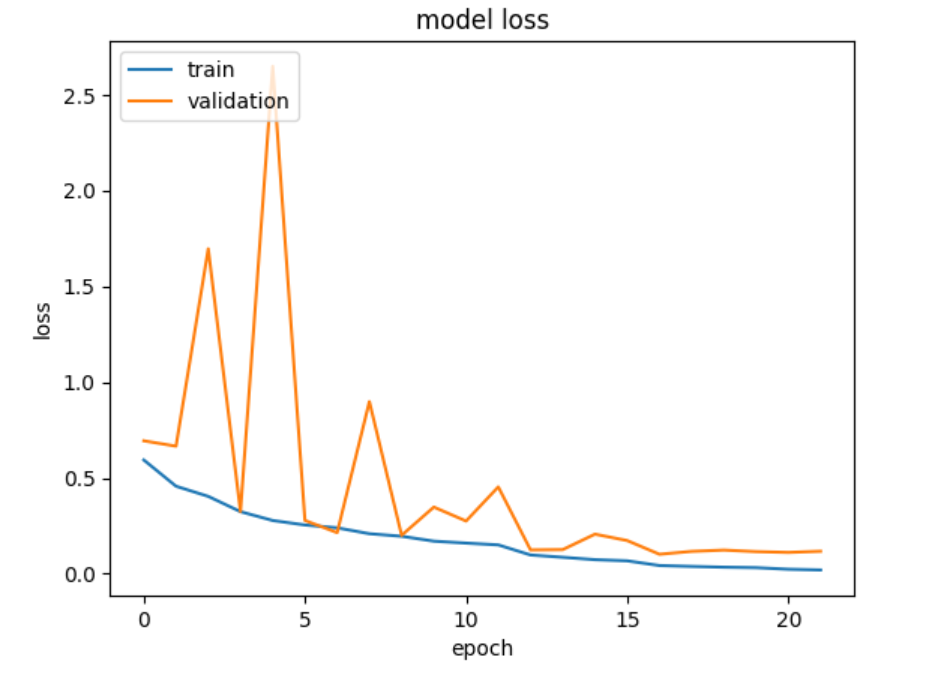
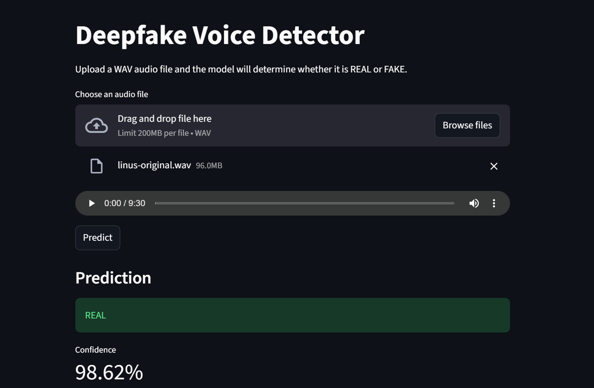
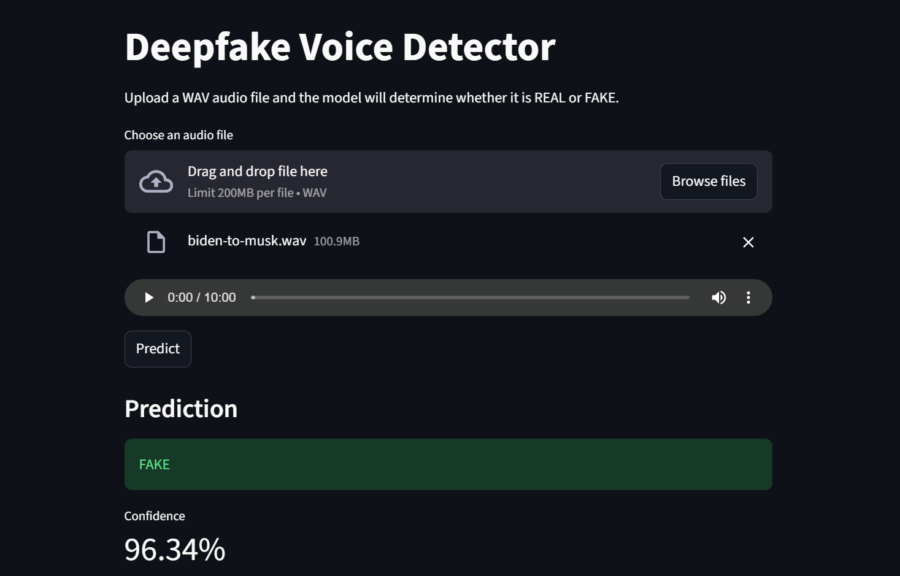

# Deepfake Voice Detection using Mel Spectrograms and CNN

## Problem Statement

The rapid advancement of Generative AI has enabled the creation of highly realistic synthetic voices. Modern voice cloning and deepfake technologies can imitate a person's speech patterns, tone, and pronunciation with remarkable accuracy.

While these technologies have legitimate applications, they also introduce significant risks including:

* Voice impersonation and identity fraud
* Social engineering attacks
* Misinformation and fake media generation
* Unauthorized use of a person's voice

Detecting AI-generated speech has therefore become an important challenge in modern cybersecurity and artificial intelligence.

This project presents an end-to-end Deep Learning solution for detecting deepfake audio using Mel Spectrogram representations and Convolutional Neural Networks (CNNs).

---

## Project Overview

The system processes raw audio recordings and classifies them as either:

* REAL Speech
* FAKE (AI-Generated) Speech

The complete pipeline includes:

```text
Raw Audio
    ↓
1-Second Windowing
    ↓
Dataset Balancing
    ↓
Mel Spectrogram Generation
    ↓
dB Scale Conversion
    ↓
Normalization
    ↓
Convolutional Neural Network (CNN)
    ↓
Deepfake Detection
```

---

## Dataset

The dataset contains both real and AI-generated speech recordings.

### Structure

* REAL audio samples
* FAKE audio samples generated through voice conversion techniques

### Processing Strategy

Long audio recordings were divided into 1-second chunks to:

* Increase the number of training samples
* Improve model generalization
* Capture local speech characteristics
* Detect deepfake artifacts more effectively

---

## Mel Spectrogram Visualization

Mel Spectrograms transform audio signals into image-like representations that capture both temporal and frequency information.

### Real Voice Spectrogram



### Fake Voice Spectrogram



---

## CNN Architectures

Two CNN architectures were evaluated.

### CNN V1

```text
Conv2D(32)
↓
BatchNormalization
↓
MaxPooling

Conv2D(64)
↓
BatchNormalization
↓
MaxPooling

Conv2D(128)
↓
BatchNormalization
↓
MaxPooling

Flatten
↓
Dense(128)
↓
Dense(64)
↓
Dense(1)
```

### CNN V2 (Selected Model)

```text
Conv2D(32)
↓
BatchNormalization
↓
MaxPooling

Conv2D(64)
↓
BatchNormalization
↓
MaxPooling

Conv2D(128)
↓
BatchNormalization
↓
MaxPooling

Conv2D(256)
↓
BatchNormalization
↓
MaxPooling

Flatten
↓
Dense(128)
↓
Dense(64)
↓
Dense(1)
```

---

## Training Curves

### CNN V1 Accuracy



### CNN V1 Loss



### CNN V2 Accuracy



### CNN V2 Loss



---

## Model Performance

| Metric    | CNN V1 | CNN V2 |
| --------- | ------ | ------ |
| Accuracy  | 96.19% | 96.39% |
| Precision | 96%    | 96%    |
| Recall    | 96%    | 96%    |
| F1 Score  | 96%    | 96%    |

CNN V2 was selected as the final model due to its slightly improved performance and lower validation loss.

---

## Confusion Matrix

```text
[[730  19]
 [ 35 713]]
```

Classification Report:

```text
Precision : 96%
Recall    : 96%
F1 Score  : 96%
Accuracy  : 96.39%
```

---

## Streamlit Deployment

A Streamlit application was developed to allow real-time deepfake voice detection.

### Real Voice Prediction



### Fake Voice Prediction



Users can:

* Upload a WAV audio file
* Listen to the uploaded audio
* Receive REAL or FAKE predictions
* View model confidence scores

---

## Technologies Used

* Python
* TensorFlow / Keras
* Librosa
* NumPy
* Scikit-Learn
* Matplotlib
* Streamlit

---

## Project Structure

```text
Deepfake-Voice-Detection/

├── data/
│   └── dataset.txt
├── download_dataset.py
├── app.py
├── models/
├── notebooks/
├── src/
│   ├── preprocess.py
│   ├── predict.py
│   └── config.py
├── assets/
├── requirements.txt
└── README.md
```

---

## Results

The proposed Deepfake Voice Detection system successfully achieved:

* 96.39% Test Accuracy
* 96% Precision
* 96% Recall
* 96% F1 Score

The project demonstrates that Mel Spectrograms combined with CNN-based feature extraction can effectively identify AI-generated speech from real human speech.

---

## Installation

Clone the repository:

```bash
git clone https://github.com/Sudhanshu-Roy/Deepfake-Voice-Detection.git
cd Deepfake-Voice-Detection
```

Create a virtual environment (recommended):

```bash
python -m venv venv
```

Activate the virtual environment:

### Windows

```bash
venv\Scripts\activate
```

### Linux / macOS

```bash
source venv/bin/activate
```

Install the required dependencies:

```bash
pip install -r requirements.txt
```

---

## Download Dataset

### Automatic Download

```bash
pip install kagglehub
```

```python
import kagglehub

path = kagglehub.dataset_download(
    "birdy654/deep-voice-deepfake-voice-recognition"
)

print("Path to dataset files:", path)
```

### Manual Download

Download directly from Kaggle:

https://www.kaggle.com/datasets/birdy654/deep-voice-deepfake-voice-recognition

---

## Run the Streamlit Application

Start the application using:

```bash
streamlit run app.py
```

The application will open automatically in your browser.

Users can:

* Upload a WAV audio file
* Listen to the uploaded audio
* Detect whether the voice is REAL or FAKE
* View prediction confidence

---

## Future Improvements

* Real-time microphone-based detection
* Audio augmentation techniques
* Transformer-based audio architectures
* Explainable AI for audio classification
* Multi-class deepfake source identification

---

## Author

**Sudhanshu Roy**

---

## ⭐ Support

If you found this project useful, consider giving it a star on GitHub. It helps others discover the project and motivates future improvements.
